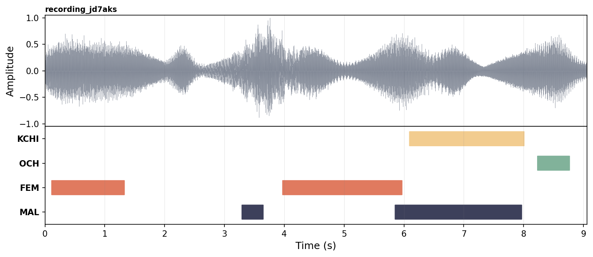

# User Guide
Make sure you've completed each step outlined on the [Getting Started](getting-started.md) page before continuing.


## Run VTC

To be able to run VTC, place your `.wav` files in a folder `audio_folder`  and run:

```bash
uv run scripts/infer.py      \
    --wavs <audio_folder>    \
    --output <output_folder> \
    --device cpu
```

A helper script is also provided — edit the variables in `scripts/run.sh` and run `sh scripts/run.sh`.

For more arguments check the [Command Line Interface Arguments](#command-line-interface-arguments) section.


## Understanding outputs

After running VTC, you get the following structure on disk with the `📂 rttm/` folder containing one RTTM file per audio. 

```
<output_folder>/
├── 📂 rttm/          # Final segments
└── 📄 rttm.csv       # Final segments as a single CSV
```

**Use `rttm.csv` for analysis.** 

You can open it in any spreadsheet application or preferably load it as a dataframe using R or Python. Each row is one speech segment with a filename (`uid`), start time (`start_time_s`), end time (`duration_s`), and the assigned speaker label (`label`).

Here is an example of a few detected segments and a visualisation of the segments

```csv
uid,              start_time_s, duration_s, label
recording_jd7aks,         0.12,       1.20,   FEM
recording_jd7aks,         3.30,       0.34,   MAL
recording_jd7aks,         3.98,       1.98,   FEM
recording_jd7aks,         5.86,       2.10,   MAL
recording_jd7aks,         6.10,       1.90,  KCHI
recording_jd7aks,         8.24,       0.52,   OCH
```


The `📂 raw_rttm/` folder contains the raw RTTM segments detected by the models before any post-processing has been applied (that merges short adjacent segments and remove isolated detections). They're mostly provided for debugging or custom pipelines.
You **MUST** use the `--keep_raw` argument when running VTC to get the raw RTTM files, otherwise the pipeline does not keep the files.

### RTTM format

The output also contains the RTTM files if needed, a standard format in speech processing. Each line represents a detected speech segment:

```
SPEAKER <uid> 1 <start_time_s> <duration_s> <NA> <NA> <label> <NA> <NA>
```
Only four fields are relevant, `uid`, `start_time_s`, `duration_s` and `label`, which are the exact same as found in the exported CSV file.
The remaining fields are placeholders (`1` and `<NA>`) required by the format but unused.


## Speed

| Setup | Speedup | 1h audio | 16h audio |
|-------|---------|----------|-----------|
| H100 GPU, batch 256 | 1/905 | ~4 sec | ~1 min |
| A40 GPU, batch 256 | 1/650 | ~6 sec | ~1.5 min |
| CPU (Xeon Silver), batch 64 | 1/16 | ~4 min | ~1 hour |

GPU processing is strongly recommended for large corpora. If you get out-of-memory errors, reduce the batch size.


## Command Line Interface Arguments
Here is the complete list of arguments you can use when running VTC.

| <div style="width: 140px;">Argument</div> | Default    | Description                                                        |
|-----------------------|--------------------------------|--------------------------------------------------------------------|
| `--config`            | `VTC-2.0/model/config.yml`     | Config file to be loaded and used for inference.                   |
| `--checkpoint`        | `VTC-2.0/model/best.ckpt`      | Path to a pretrained model checkpoint.                             |
| `--wavs`              | **required**.                  | Folder containing the audio files to run inference on.             |
| `--output`            | **required**                   | Output path to the folder that will contain the final predictions. |
| `--uris`              | —                              | Path to a file containing the list of URIs to use.                 |
| `--save_logits`       | `False`                        | Save the logits to disk. Can be memory intensive.                  |
| `--thresholds`        | —                              | Path to a thresholds dict to perform predictions via thresholding. |
| `--min_duration_on_s` | `0.1`                          | Remove speech segments shorter than that many seconds.             |
| `--min_duration_off_s`| `0.1`                          | Fill same-speaker gaps shorter than that many seconds.             |
| `--batch_size`        | `128`                          | Batch size for the forward pass of the model.                      |
| `--recursive_search`  | `False`                        | Recursively search for `.wav` files. May be slow.                  |
| `--device`            | `cuda`                         | Device to use. Choices: `gpu`, `cuda`, `cpu`, `mps`.               |
| `--keep_raw`          | `False`                        | Keep raw RTTM and save to `<output>/raw_rttm/`.                    |